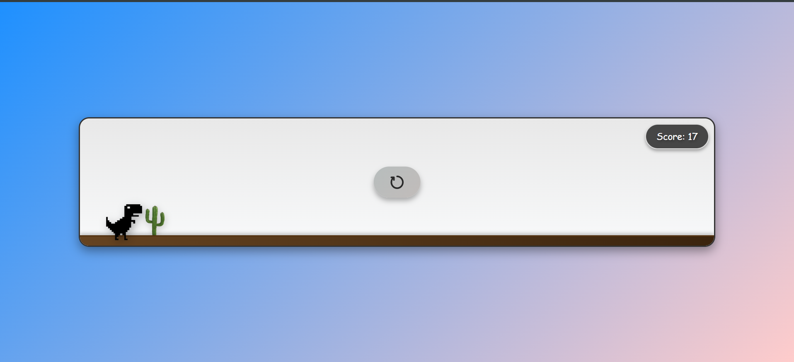

# Dino Runner Game

Welcome to the **Dino Runner Game**! This is a simple, fun, and interactive browser-based game inspired by the classic Chrome Dino game. The goal is to avoid obstacles (cacti) by jumping over them, and your score increases the longer you survive. The game is built using HTML, CSS, and JavaScript.

---

## 🎮 How to Play

1. **Start the Game**: Open the `index.html` file in your browser.
2. **Jump**: Press the `Spacebar` or click anywhere on the screen to make the dino jump.
3. **Avoid Obstacles**: Dodge the cacti to keep the game going.
4. **Score**: Your score increases over time. See how high you can go!
5. **Game Over**: If the dino collides with an obstacle, the game ends. Click the restart button to play again.

---

## �️ Features

- **Responsive Design**: Works on both desktop and mobile devices.
- **Score Tracking**: Real-time score display.
- **Restart Functionality**: Easily restart the game after a collision.
- **Smooth Animations**: CSS animations for dino jumping and obstacle movement.
- **Interactive UI**: Clean and visually appealing design with dynamic background and shadows.

---

## 🛠️ Technologies Used

- **HTML**: Structure of the game.
- **CSS**: Styling and animations.
- **JavaScript**: Game logic, collision detection, and score tracking.

---

## 🚀 Getting Started

### Prerequisites
- A modern web browser (Chrome, Firefox, Safari, etc.).

### Installation
1. Clone the repository:
   ```bash
   git clone https://github.com/batman-hassaan/dino-runner-game.git
   ```
2. Navigate to the project directory:
   ```bash
   cd dino-runner-game
   ```
3. Open the `index.html` file in your browser.

---

## 🎨 Customization

You can easily customize the game by modifying the following files:
- **`dino.css`**: Change the styling, colors, animations, and layout.
- **`dino.js`**: Adjust game logic, speed, and scoring mechanics.
- **Assets**: Replace the dino and cactus images with your own.

---

## 📂 File Structure

```
dino-runner-game/
├── index.html          # Main HTML file
├── dino.css            # Stylesheet for the game
├── dino.js             # JavaScript for game logic
├── pngegg (20).png     # Dino image
├── Cactus.png          # Obstacle image
└── restart.svg         # Restart button icon
```

---

## 🎥 Preview



---

## 🤝 Contributing

Contributions are welcome! If you have any ideas, improvements, or bug fixes, feel free to open an issue or submit a pull request.

---

## 📄 License

This project is licensed under the MIT License. See the [LICENSE](LICENSE) file for details.

---

## 🙏 Acknowledgments

- Inspired by the Chrome Dino Game.
- Thanks to [Google Fonts](https://fonts.google.com/) for the fonts used in the project.

---

Enjoy the game! 🦖

---

**Made with ❤️ by [Hassaan**  
📧 linked in: [linked in ](https://www.linkedin.com/in/hassaanshahid217/)
🌐 Portfolio: [your-portfolio-link]  
